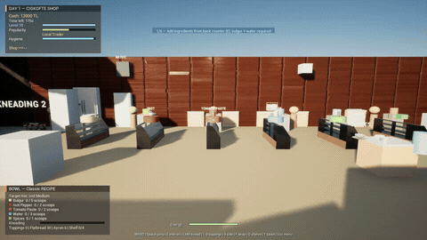
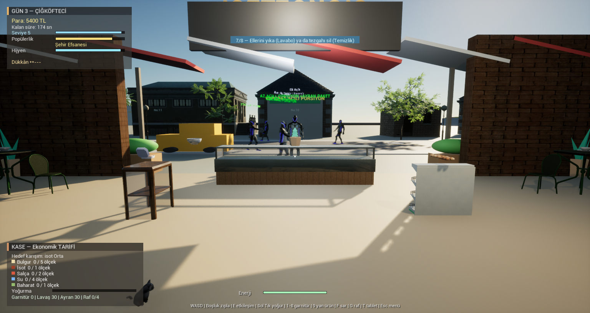
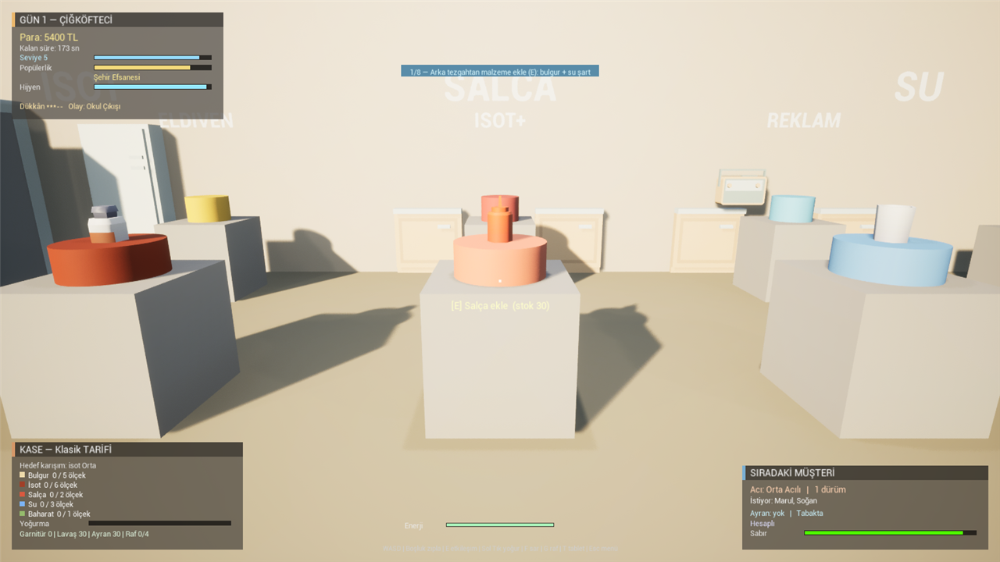
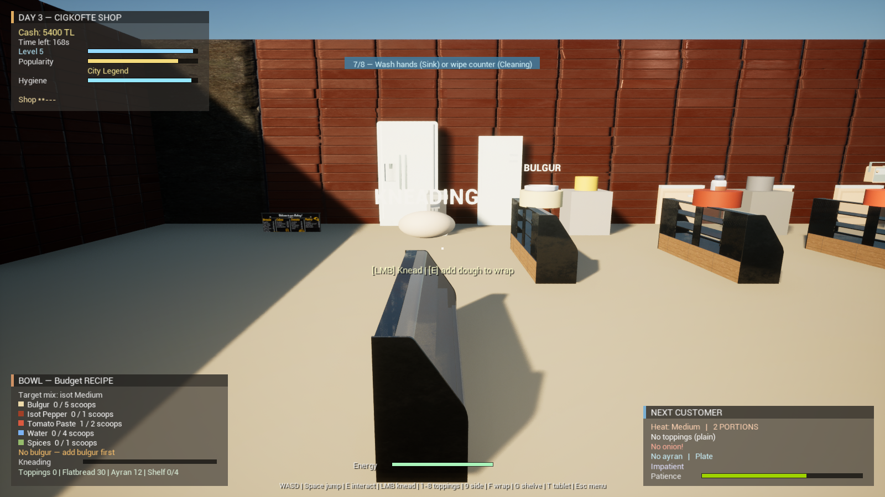
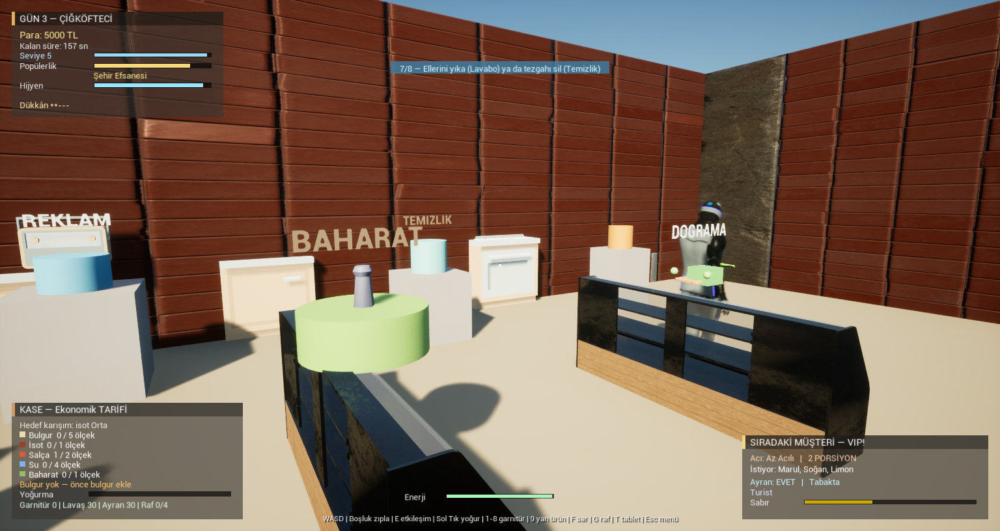
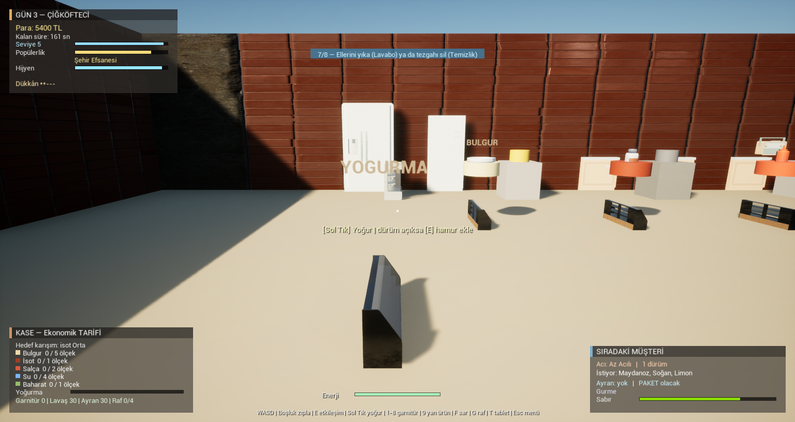
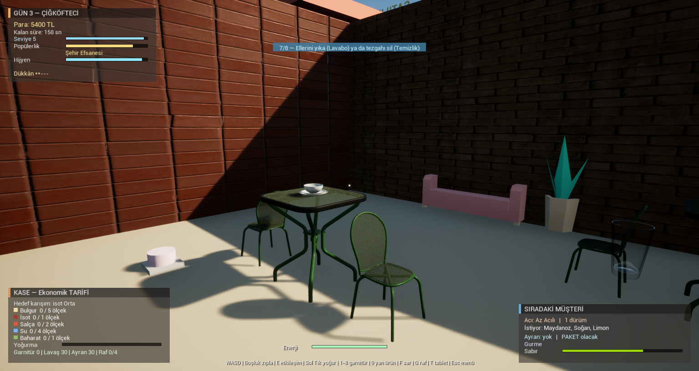

# Çiğköfte Simulator

*[English](README.md)*

**Bir mahalle çiğköftecisini sıfırdan işlet.** Bulguru yoğur, isotu ayarla, dürümü sar, müşteriyi
sabrı taşmadan yetiştir; kazandığın parayla dükkânı büyüt. Unreal Engine 5.8 üzerinde
**tamamen C++** ile yazılmış, birinci şahıs bir işletme/pişirme simülasyonu.

> Bir **EG Games** yapımı.



*Sabit tur rotasından on iki saniye. Paketli yapıdan `Scripts/Record-Demo.ps1`
ile kaydedildi; o gün fareyi kimin tuttuğuna göre değil, her seferinde aynı klibi
üretir.*



| | |
| --- | --- |
|  |  |
| *Bulgur, isot, salça, su, baharat — her tezgâh ayrı ölçek* | *Yoğurma: sol tıkla harcı hazırla* |
|  |  |
| *Dükkân geliştirmeleri* | *Günlük görevler, hikâye hedefleri, müdavimler* |
|  | |
| *Yerinde yiyen müşteriler masaya oturur* | |

## Oynanış

Her gün 3 dakikadır. Gün başlar, müşteriler sırayla gelir, sipariş verir ve sabır çubukları dolarken
sen mutfakta koştururursun. Gün sonunda kira düşer, kazanç ve itibar hesaplanır, ertesi gün açılır.

**Bir dürümün yolculuğu:**

1. **Harç** — bulgur, isot, salça, su, baharat istasyonlarından ölç. İstenen acılık (az acı / orta /
   çok acı) isot miktarına bağlı.
2. **Yoğurma** — tezgâha bak ve sol tıkla; her vuruş harcı biraz daha hazırlar.
3. **Doğrama** — marul, maydanoz, domates, turşu, soğan, limon, nar ekşisi.
4. **Lavaş & sarma** — lavaşı koy, `1-7` ile garnitürleri seç, `8` ayran, `9` yan ürün ekle, `F` ile sar.
5. **Servis** — tabakta mı paket mi? Müşterinin istediğini ver, parayı ve XP'yi al.

**Menü sadece dürüm değil.** Seviye 3'te yan ürün tezgâhı açılır: içli köfte, mercimek çorbası,
künefe ve çay. Müşteri "yanında künefe" isteyebilir; doğru ürünü koyarsan hem fiyat hem puan artar,
unutursan sipariş puanı düşer. Tedarikçi sekmesinden **malzeme kalitesini** de seçersin — ucuz
malzeme kâr bırakır ama gurme müşteri farkı anlar, kaliteli malzeme maliyeti yükseltir.

Sipariş ne kadar birebir tutarsa bahşiş ve itibar o kadar yüksek; yanlış acılık, eksik garnitür ya da
geciken servis müşteriyi kızdırır.

## Açılan dünya

Oyun her şey açıkken başlamaz. İlk gün elinde sade bir tezgâh vardır: bulgur, isot, salça, su,
baharat, yoğurma, lavaş ve servis. Doğrama, paketleme, buzdolabı, çay ocağı, mama kabı gibi
istasyonlar kilitli durur — üstlerinde "SEVIYE N" yazar, dokunduğunda açılış seviyesini söyler.
Müşteriler de kapalı istasyonun işini istemez: doğrama açılmadan kimse garnitür, paketleme
açılmadan kimse paket servis istemez.

Mahalle de aynı şekilde büyür. Ana caddenin iki ucundaki kavşaklar ve oradan batıya uzanan
caddeler başta şantiye bariyeriyle kapalıdır; seviye geldikçe bariyer kalkar, bölge canlanır ve
yeni teslimat adresleri açılır:

| Seviye | Bölge | Ne var |
| --- | --- | --- |
| 2 | Semt Pazarı | Tenteli tezgâhlar, sebze reyonları, pazar esnafı |
| 3 | Cumhuriyet Meydanı | Fıskiyeli havuz, saat kulesi, banklar, kalabalık |
| 4 | Okul ve Park | Okul binası, bayrak direği, salıncak-kaydırak, öğrenciler |
| 5 | Sanayi — Tedarikçi Deposu | Depolar, yükleme rampası, variller, kamyon |
| 6 | Şehir Stadı | Tribün halkası, projektör direkleri, maç günü izdihamı |
| 7 | Sahil Kordonu | Deniz, kum, palmiyeler, şemsiyeler, kordon korkuluğu |

Gün ilerledikçe güneş alçalır ve akşamüstü sokak lambaları yanar; yağmurda zemin ıslanır, gökyüzü
kurşunileşir, ekrana damla çizgileri düşer; kavurucu sıcakta dünya sarıya çalar; elektrik
kesintisinde dükkânın ışıkları söner.

## Ustalık, prestij ve başarımlar

Her seviye atlayışı bir **yetenek puanı** getirir. Tabletin Yetenekler sekmesinden dağıtırsın:

| Yetenek | Etki |
| --- | --- |
| Hızlı El | Yoğurma vuruşları rütbe başına %15 daha etkili |
| Keskin Bıçak | Doğrama rütbe başına 1 vuruş azalır |
| Güler Yüz | Bahşiş ve itibar kazancı rütbe başına %12 artar |
| Temiz İşçi | Kirlenme rütbe başına %15 yavaşlar |
| Dayanıklı Bünye | Enerji tüketimi rütbe başına %20 azalır |
| Hızlı Ayak | Koşu hızı rütbe başına %8 artar |
| Pazarlık Ustası | Stok maliyeti rütbe başına %8 düşer |
| Mutfak Ustası | Hamur kalitesi rütbe başına %5 artar |

Seviye 10'a ulaşıp kasanda 20.000 TL biriktirdiğinde dükkânı **devredebilirsin** (prestij). Gün,
seviye, kasa ve bütün yatırımlar sıfırlanır; yetenekler, başarımlar ve açılmış mahalle bölgeleri
kalır, üstüne her devretme kalıcı **%12 gelir bonusu** ve 3 yetenek puanı bırakır.

**20 başarım** var — ilk dürümden 1000 dürüme, ilk teslimattan beş yıldıza, tam donanımlı dükkândan
devretmeye kadar. Tabletin Başarımlar sekmesinde toplam istatistiklerinle birlikte durur.

## Sistemler

18 bağımsız sistem, oyunu bir "tıkla ve sat" döngüsünden çıkarıp işletmeye çeviriyor:

| Sistem | Ne yapıyor |
| --- | --- |
| **Müşteriler** | 14 farklı karakter özelliği — Sabırsız, Gurme, Fenomen, Turist, Öğrenci, Müdavim, Gizli Eleştirmen… Her biri farklı sipariş verir, farklı tepki gösterir. |
| **Sipariş & Tarif** | Acılık, porsiyon, garnitür maskesi, ayran, paket/tabak. Yeni tarifler seviye ile açılır. |
| **Ekonomi** | Fiyatlandırma, kira, tedarikçiler, stok maliyetleri, günlük kâr-zarar. |
| **Stok** | 14 kalem malzeme, tedarikçiden sipariş, kıtlık ve zam olayları. |
| **Hijyen** | Tezgâh kirlenir, eldiven değişir, el yıkanır, bulaşık birikir. Titiz müşteri fark eder. |
| **İtibar & Yorumlar** | Müşteriler puan verir, yorum yazar; ortalama puan müşteri akışını belirler. |
| **Rakipler** | Mahalledeki diğer büfeler kampanya yapar, müşteri çalar. |
| **Olaylar** | Okul çıkışı, maç günü, yağmur, sıcak hava, elektrik kesintisi, belediye denetimi, sokak festivali, isot zammı ve daha fazlası. |
| **Görevler** | Günlük ve zincirleme hedefler, ödüllü. |
| **Personel** | Eleman al, maaş öde, işleri devret. |
| **Paket Servis** | Seviye 4'te araba açılır; şehirde adrese teslimat. |
| **İlerleme** | 10 seviye, XP, unvanlar, toplam istatistikler. |
| **Yetenekler** | 8 ustalık yeteneği, seviye başına puan, prestij (devretme) döngüsü. |
| **Başarımlar** | 20 başarım, istatistik ekranı. |
| **Dükkân** | 13 geliştirme — büyük buzdolabı, klima, müzik sistemi, ikinci kasa, dış oturma alanı, yeni şube… hepsi hem dünyayı hem oynanışı değiştirir. |
| **Kedi** | Dükkânın kedisi var. İsmini koyabilir, mamasını verebilir, sevebilirsin. |
| **Kayıt** | Versiyonlu kayıt sistemi, `F5` / `F9`. |
| **Ses** | Yoğurma, doğrama, kasa, jingle'lar — hepsi olay tabanlı. |

Tablet (`T`) sekmelerinden stok, tarifler, dükkân geliştirmeleri, tedarikçiler, rakipler, yorumlar,
görevler ve personel yönetilir.

## Kontroller

Oyun klavye/fare ve **gamepad** ile oynanır; HUD ipuçları kullandığın cihaza göre değişir.

| Tuş | Gamepad | İşlev |
| --- | --- | --- |
| `W A S D` | Sol çubuk | Hareket |
| `Shift` | L3 | Koş |
| `Space` | Y | Zıpla |
| `Fare` | Sağ çubuk | Bak |
| `E` | A | Etkileşim (istasyon / araba / kediyi sev / teslimat) |
| `Sol tık` | RT | Yoğurma vuruşu |
| `1` – `7` | LB/RB seç, B uygula | Dürüme garnitür ekle/çıkar |
| `8` | aynı | Ayran ekle/çıkar |
| `9` | aynı | Yan ürün ekle (içli köfte / çorba / künefe / çay) |
| `F` | X | Dürümü sar ve bitir |
| `G` | R3 | Sarılı dürümü rafa kaldır |
| `T` | Select | Tablet (stok, dükkân, yetenekler, başarımlar…) |
| `O` | — | Ayarlar |
| `Esc` / `P` | Start | Duraklat |
| `F5` / `F9` | — | Kaydet / Yükle |
| `F1` | — | Debug HUD |
| `R` | — | Oyun bitince yeniden başlat |
| `↑ ↓ ← →` + `Enter` | D-Pad + A | Menü ve tablet navigasyonu (sekme: LB/RB) |

## Kurulum

Gereken: **Unreal Engine 5.8** ve Visual Studio 2022 (C++ masaüstü geliştirme yükü).

```bash
git clone https://github.com/adilalperenciftci/CigkofteSimulator.git
cd CigkofteSimulator
```

`CigkofteSimulator.uproject` dosyasına sağ tıklayıp **Generate Visual Studio project files** deyip
solution'ı derleyebilir ya da doğrudan komut satırından derleyebilirsin:

```powershell
& "C:\Program Files\Epic Games\UE_5.8\Engine\Build\BatchFiles\Build.bat" `
    CigkofteSimulatorEditor Win64 Development `
    -project="$PWD\CigkofteSimulator.uproject" -WaitMutex
```

Sonrasında `.uproject` dosyasına çift tıklaman yeterli. Dünya runtime'da kurulduğu için hazır bir
level açman gerekmez — Play'e basınca dükkân kendini inşa eder.

### Asset paketleri hakkında

> **Depo, ek asset indirmeden derlenir ve çalışır.** Aşağıdaki paketlerin hiçbiri derleme için
> gerekli değildir. `CigMeshLibrary` her mesh yüklemesinde asset bulunamazsa `nullptr` döner ve
> çağıran taraf `/Engine/BasicShapes` primitive'ine düşer — oyun kutu-primitif görselleriyle
> baştan sona oynanabilir. Eksik asset uyarıları `LogCig` kanalına `Warning` olarak düşer,
> hata değildir.

Depoda ne var, ne yok:

| Klasör | Durum | Kaynak |
| --- | --- | --- |
| `Content/LowPoly/` | **Depoda** | Kenney Food Kit + Furniture Kit (CC0) |
| `Content/Audio/` | **Depoda** | Kenney Interface/Impact/RPG/Music Jingles (CC0) |
| `Content/dukkan/`, `Content/Fab/`, `Content/ModellerEnistem/`, `Content/ModellerEnistem2/` | Depoda yok | Fab / Unreal Marketplace mağaza içeriği |
| `Content/CityPark/` | Depoda yok | Şehir parkı sahne paketi (Fab) |
| `Content/Scene_Bazaar_Vol1/` | Depoda yok | Çarşı-pazar sahne paketi (Fab) |
| `Content/CitySampleBuildings/`, `Content/ModularBuildingSet/`, `Content/MMSupermarket/`, `Content/Scene_Banquet/` | Depoda yok | Bina/iç mekân paketleri (Fab) |
| `Content/Cat_Animation_Pack/` | Depoda yok | Kedi modeli ve animasyonları (Fab) |
| `Content/Characters/`, `Content/MC_Sample/` | Depoda yok | Karakter mesh'leri ve mocap (Fab) |

Ağır paketler `.gitignore`'da: tekil `.uasset` dosyaları GitHub'ın 100 MB sınırını aşıyor ve
lisansları yeniden dağıtıma izin vermiyor. Bu paketlere sahipsen, Fab kütüphanenden indirip
tablodaki klasör adıyla `Content/` altına kopyalaman yeterli — kod tarafında yapılacak bir şey yok,
mesh yolları yukarıdaki klasör adlarına göre çözülür (`World/CigMeshLibrary.cpp`).

## Mimari

`ACigkofteGameMode` bir koordinatör; oynanışın tamamı `UCigSystem` (UObject) türevi 18 sisteme
bölünmüş ve `Source/CigkofteSimulator/` altında klasörlenmiştir:

```
Core/        ortak tipler, log, upgrade tanımları
Game/        GameMode + gün döngüsü + sistem taban sınıfı
World/       runtime dünya kurucu, istasyonlar, mesh kütüphanesi
Cooking/  Orders/  Customers/  Economy/  Inventory/
Progression/  Quests/  Events/  Delivery/  Hygiene/  Staff/  Cat/
Player/  Vehicles/  UI/  Save/  Audio/  Debug/
```

Blueprint oynanış mantığı yoktur; HUD dahil her şey C++ ile çizilir. Dünya, `/Engine/BasicShapes`
primitive'leri ile Kenney low poly mesh'lerinin karışımından oluşur — asset bulunamazsa sistem
otomatik olarak primitive'e düşer, yani proje eksik asset'le de çalışır.

### Denge sayıları veri tarafında

Yetenekler, dükkân geliştirmeleri, müşteri özellikleri, stok kalemleri ve başarımlar
`Config/Balance/*.csv` dosyalarından okunur:

| Dosya | Neyi ayarlar |
| --- | --- |
| `Skills.csv` | Yetenek adı, azami rütbe, rütbe başına etki katsayısı |
| `Upgrades.csv` | Geliştirme fiyatı ve açılış seviyesi |
| `Traits.csv` | Özellik havuz ağırlığı, görünme günü, sabır ve bahşiş etkileri |
| `Stock.csv` | Malzeme taban fiyatı, başlangıç stoğu, sipariş miktarı |
| `Achievements.csv` | Başarımın baktığı istatistik ve eşiği |

Satırlar `FTableRowBase` türevi USTRUCT'lara karşılık gelir (`Core/CigBalanceTypes.h`), yani
istenirse editörde aynı sütunlarla `UDataTable` asset'i de oluşturulabilir. Çalışma zamanında CSV
okunur çünkü UDataTable'ın CSV içe aktarımı yalnızca editörde çalışır.

Dosya yoksa, bozuksa veya bir satır eksikse `Core/CigBalance.cpp`'deki C++ varsayılanları geçerli
olur — depo bu dosyalar silinse de aynı dengeyle oynanır. Oyun açıkken konsoldan
`CigReloadBalance` tabloları yeniden okur, yani bir sayıyı denemek için yeniden derlemek gerekmez.

### Müşteri diyalogu: üretim hattı, runtime API değil

Müşteri replikleri oyun sırasında API'ye sorularak değil, **geliştirme sırasında toplu üretilip
veri olarak dağıtılarak** üretilir. Böylece runtime maliyeti sıfır, gecikme sıfır, oyun internetsiz
çalışır ve moderasyon riski yoktur.

Durum uzayı sonludur: 5 ruh hali × 15 baskın müşteri özelliği × 2⁵ (VIP, müdavim, ayran, hijyen,
sabır) = **2.400 kova**. Kova başına 4 varyantla ~9.600 replik.

```
1. Editörde konsoldan:  CigGenerateDialogue     → Saved/Dialogue/prompts.jsonl (2.400 istem)
2. python Tools/generate_dialogue.py            → Config/Dialogue/Lines.csv
3. CSV gözden geçirilip commit edilir
```

İkinci adım ayrı bir betiktir çünkü para harcar, saatler sürebilir ve yarıda kalabilir; betik
kaldığı yerden devam eder (`--limit N` ile önce küçük bir deneme yapılabilir) ve
`ANTHROPIC_API_KEY` ortam değişkeni ister.

Tablo iki dilli (`TR`, `EN`) olduğu için İngilizce aynı hattan bedava gelir. Kova bulunamazsa oyun
koddaki hazır cümlelere düşer — depoda şu an gözden geçirilmiş bir tohum tablo var.

### Rastgelelik deterministik

Oynanışı etkileyen bütün zarlar tek bir `FRandomStream` üzerinden akar
(`Core/CigRandomSubsystem.h`). Seed ve akışın konumu kayda yazılır: aynı seed aynı günü aynı
biçimde oynatır, kayıt yüklemek akışı başa sarmaz. Bir hata bildirimini birebir tekrar üretmek için
konsoldan `CigSeed` ile seed'i okuyup `CigSetSeed <n>` ile geri verebilirsin. Dünya süslemesi, kedi
tüyü rengi, trafik ve diyalog cümlesi seçimi bilerek bu akışın dışındadır — oyun durumunu
değiştirmezler.

Geliştirme sırasında `F1` debug HUD'unu açar; konsolda `StartDayNow`, `AddMoney`, `SpawnCustomer`,
`UnlockAllUpgrades`, `SetTimeScale`, `CigSeed`, `CigSetSeed`, `CigReloadBalance` gibi onlarca exec
komutu vardır (`Debug/CigCheatManager.h`).
Yukarıdaki ekran görüntüleri `CigShots` komutuyla üretilir:

```powershell
& "C:\Program Files\Epic Games\UE_5.8\Engine\Binaries\Win64\UnrealEditor.exe" `
    "$PWD\CigkofteSimulator.uproject" -game -windowed -ResX=1600 -ResY=900 -ExecCmds="CigShots"
```

## Lisans & Krediler

Kodun tamamı özgündür ve **tüm hakları saklıdır** — depo herkese açık olarak görüntülenebilir
ancak açık kaynak değildir; koşullar için [LICENSE](LICENSE) dosyasına bak.

Depodaki görsel ve ses assetleri **Kenney** (CC0, kamu malı) kaynaklıdır ve bu lisansın dışındadır
— ayrıntı için [CREDITS.md](CREDITS.md).
